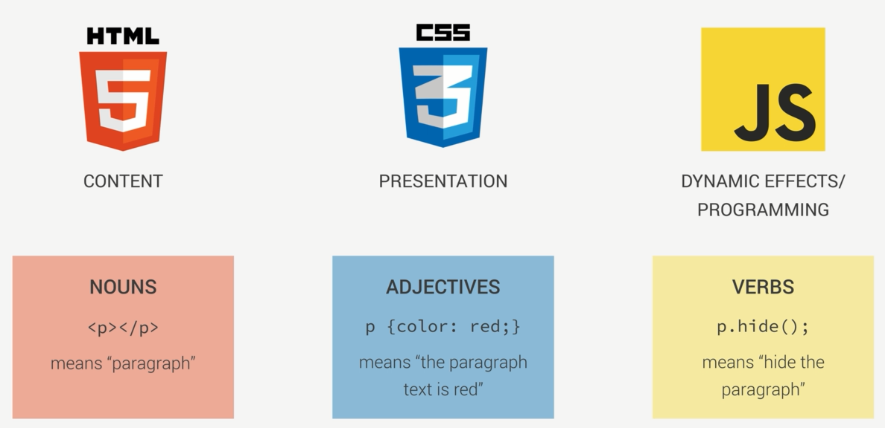

1. inline and external scripts.
2. Role of javascript in the web development

3. javascript数据类型： Number,String ,boolean,Undefined,Null
4. console.log() | alert() | prompt() 的区别
5. operator **typeof**

> 下一节2-9