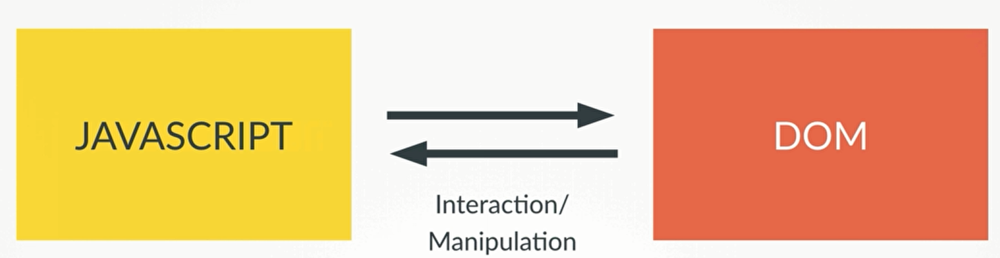

1. inline and external scripts.
2. Role of javascript in the web development


3. javascript数据类型： Number,String ,boolean,Undefined,Null
4. console.log() | alert() | prompt() 的区别
5. operator **typeof**
6. console.log()非常强大，能直接输出数组，对象
7. 在对象声明this.attri,会添加为javascript的属性，动态添加
    ```javascript
    var person = {
        name: "Q10Viking",
        generateAge: function() {
            this.age = 23;
        }
    }

    console.log(person);
    person.generateAge();
    console.log(person);
    /**
     {name: "Q10Viking", generateAge: ƒ}
    {name: "Q10Viking", generateAge: ƒ, age: 23}
    */
    ```

----------
8. hoisting function 在全局中定义可以先使用后定义。
9. scope chain. 是在定义的时候，而不是调用的关系
10. this关键字代表的意义，global object **window**, this 代表我们定义的对象。注意innerFunction 
    ```javascript 
     var john = {
     name: "Q10Viking",
     call: function(){
         console.log(this.name);
         console.log(this);
         function innerFunction() {
            console.log(this.name);
            console.log(this);
         }
         innerFunction();
     }
    }

    john.call();
    /*
    Q10Viking
    {name: "Q10Viking", call: ƒ}

    Window {postMessage: ƒ, blur: ƒ, focus: ƒ, close: ƒ, parent: Window, …}
    */
    ```

    ```javascript
    //this 在这当中代表的对象变化
    var john = {
        name: "Q10Viking",
        call: function(){
            console.log(this.name);
        }
    }

    var school = {
        name: "CAU"
    }

    school.call = john.call;
    school.call();
    //OUTPUT: CAU
    ```
     
----------

11. javascript interaction with dom 

12. 从html中读取和写入数据: DOM选择box的然后 textContent
```javascript
document.querySelector('#name-'+activePlayer).textContent = 'Winner!';
```
13. javascript控制css样式
    ```javascript
    document.querySelector('.player-0-panel').classList.toggle('active');
    document.querySelector('.player-0-panel').classList.remove('active');
    document.querySelector('.player-0-panel').classList.add('active');
    ```
14. 为html的box element添加事件监听器,事件的内容，以及相应的回调函数 
    ```javascript
    //匿名函数
    document.querySelector(".btn-hold").addEventListener('click',function () {
            //...some code
        }
    });

    //直接调函数名
    document.querySelector('.btn-new').addEventListener('click',init);
    ```

15. system state variable 的控制
16. javascript 获取html元素box的方式
    ```javascript
        document.getElementById('current-1').textContent = '0';
        document.querySelector('.player-0-panel').classList.toggle('active');
    ```